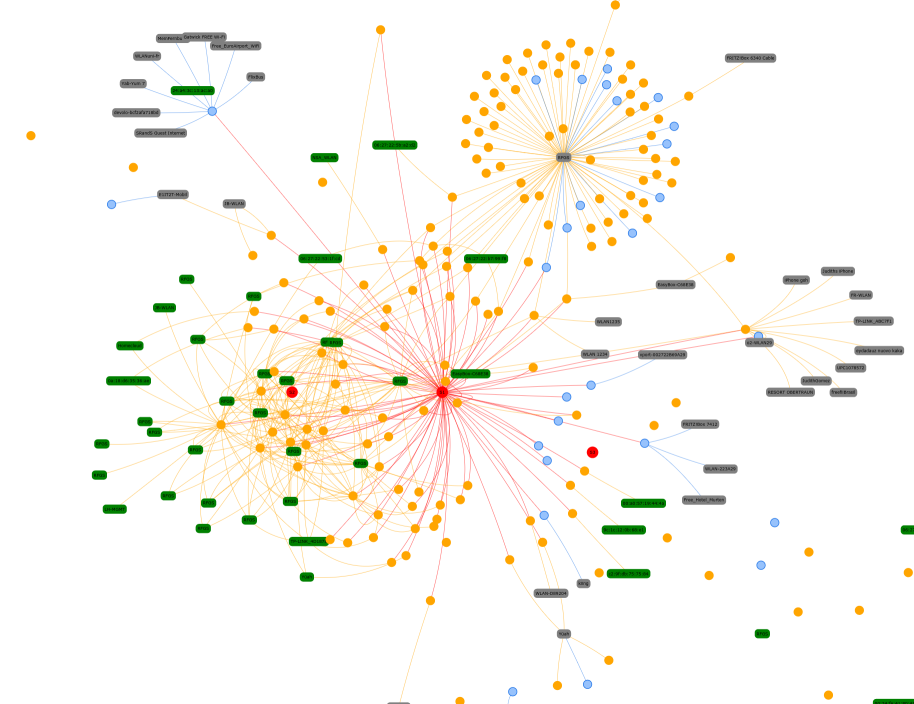

# mtrack

mtrack receives 802.11 probe requests and beacons and visualizes them on a live map.

It supports multiple receiver nodes. Nodes moving between different receiver nodes
move on the map, which allows crude location tracking inside large buildings.

Project was created to demonstrate the dangers of 802.11 probe request tracking.

## Screenshot

